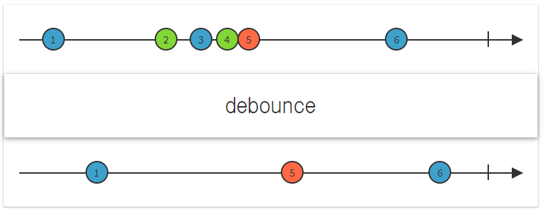

# Rx-Console-PressKey-POC

## 목표
- Rx를 사용하여 KeyPress를 처리한다.

## 참조
- https://stackoverflow.com/questions/10675451/iobservable-of-keys-pressed

## Debounce
- http://reactivex.io/documentation/operators/debounce.html
- 특정 시간 범위가 지난 경우에만 Observable에서 항목을 내 보낸다.

